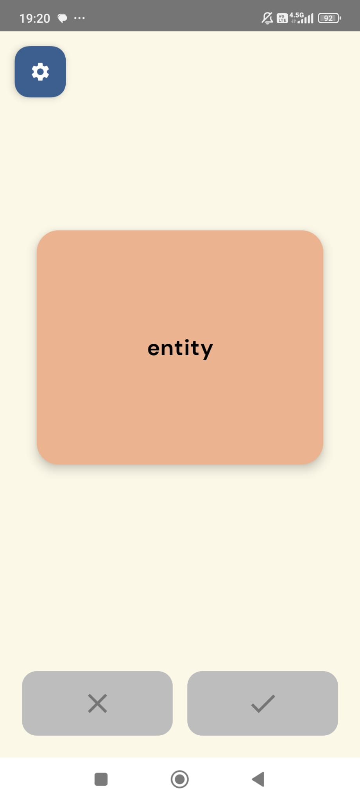
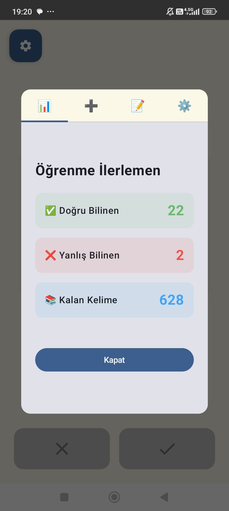
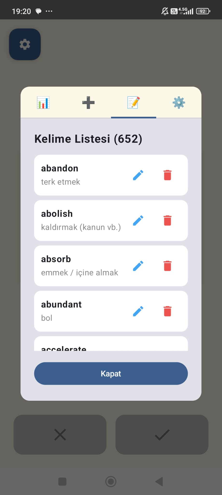
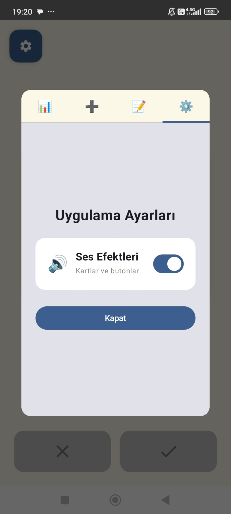

# YDS Kelime Öğrenme Uygulaması

Android tabanlı interaktif kelime öğrenme uygulaması. YDS sınavına hazırlanan öğrenciler için geliştirilmiştir.

## Ekran Görüntüleri

<p align="center">
  
  
  
  
</p>

## Özellikler

### Ana Özellikler
- 1000+ YDS kelimesi hazır dataset olarak yüklü
- 3D flip animasyonu ile etkileşimli kart sistemi
- Akıllı tekrar algoritması - yanlış bilinen kelimeler otomatik olarak tekrar gelir
- İlerleme takibi ve istatistikler
- Özel kelime ekleme, düzenleme ve silme
- Ses efektleri (açma/kapama seçeneği)
- Rastgele kelime sıralaması
- Veri kalıcılığı - ilerlemeniz kaydedilir

### Kullanıcı Deneyimi
- Minimal ve modern Material Design 3 arayüzü
- Özel renk paleti ve DM Sans fontu
- Kartı çevirmeden butonlar devre dışı
- Tekrar kontrolü - aynı kelime iki kez eklenemez
- Kelime listesinde scroll ve yönetim

## Teknik Detaylar

### Kullanılan Teknolojiler
- **Kotlin** - Ana programlama dili
- **Jetpack Compose** - Modern deklaratif UI framework
- **Material Design 3** - UI component library
- **SharedPreferences** - Veri kalıcılığı
- **Gson** - JSON serialization
- **MediaPlayer** - Ses efektleri

### Mimari
- MVVM benzeri yapı
- WordManager sınıfı ile iş mantığı ayrımı
- SoundManager ile ses yönetimi
- Composable fonksiyonlarla modüler UI

### Minimum Gereksinimler
- Android 7.0 (API 24) ve üzeri
- 50 MB boş alan

## Kurulum

1. Repository'yi klonlayın:
```bash
git clone https://github.com/[kullanici-adi]/yds_kelime.git
```

2. Android Studio'da projeyi açın

3. Gradle sync tamamlanmasını bekleyin

4. Uygulamayı çalıştırın (Run > Run 'app')

## Kullanım

1. **Kelime Öğrenme**
   - Ana ekranda İngilizce kelime görünür
   - Karta tıklayarak Türkçe karşılığını görün
   - Doğru biliyorsanız yeşil (✓) butonuna basın
   - Yanlış biliyorsanız kırmızı (✗) butonuna basın

2. **İstatistikler**
   - Sol üstteki ayarlar butonuna tıklayın
   - İstatistikler sekmesinden ilerlemenizi görün

3. **Kelime Ekleme**
   - Ayarlar > Kelime Ekle sekmesine gidin
   - İngilizce ve Türkçe karşılığını girin
   - Sistem otomatik tekrar kontrolü yapar

4. **Kelime Yönetimi**
   - Ayarlar > Kelime Listesi sekmesine gidin
   - Kelimeleri düzenleyin veya silin
   - Alfabetik sırayla görüntülenir

5. **Ses Ayarları**
   - Ayarlar > Uygulama Ayarları sekmesinden
   - Ses efektlerini açıp kapatabilirsiniz

## Lisans

MIT License
